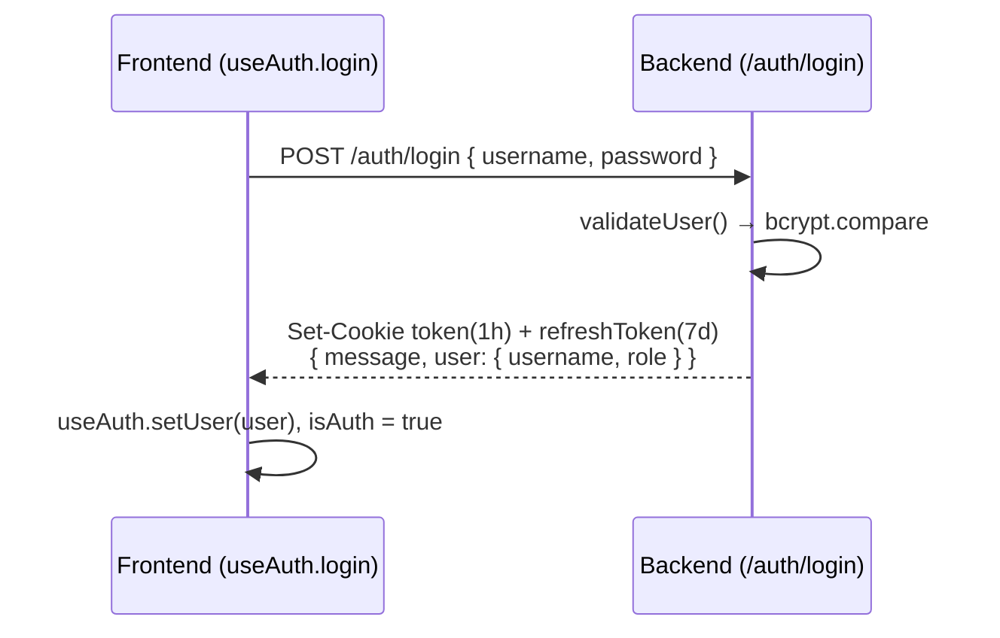
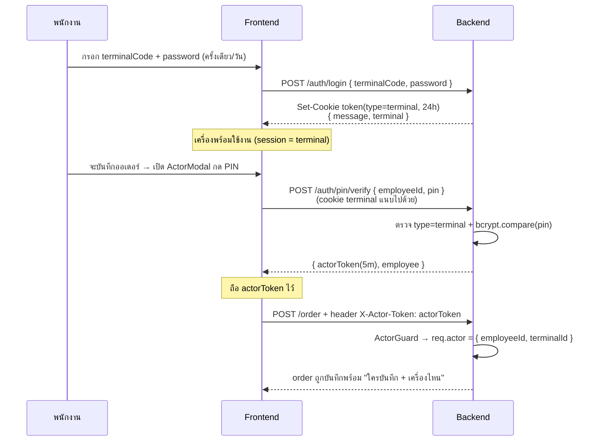
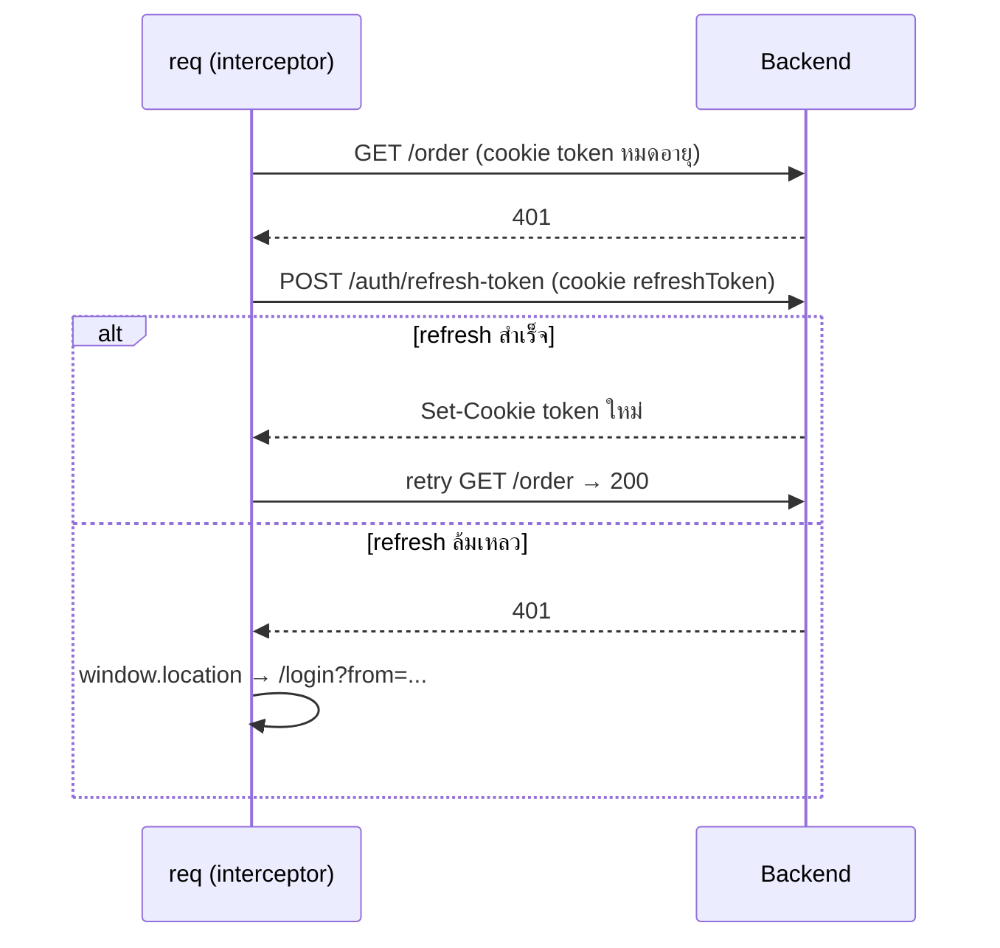

# Auth Flow — SLJ Supply Center ERP

> สรุปว่า **frontend (`ERP-Front-SLJ`) ↔ backend (`ERP-Back-SLJ`) คุยกันเรื่อง auth อย่างไร** และมีได้กี่แบบ
> อ้างอิงจากโค้ดจริงทั้งสอง repo (ไม่ใช่การเดา) — ปรับปรุงเมื่อ 2026-07-05
>
> **TL;DR:** auth เป็น **cookie-based JWT** · มี **2 โหมดล็อกอิน** (บัญชีผู้ใช้ / เครื่อง Terminal) · มี **ชั้นยืนยันตัวตนเพิ่ม (Actor/PIN)** สำหรับ Terminal · รวม **token 4 ชนิด** · การผูก "ใครบันทึก + terminal" เข้ากับออเดอร์ **✅ ต่อครบแล้วทั้งสองฝั่ง** (Phase 1 — ดู §7)

---

## 1. ภาพรวม (Architecture)

- **Transport:** ทุก request ใช้ **httpOnly cookie** ผ่าน `withCredentials: true` — **ไม่มี** `Authorization: Bearer` header
  - Frontend: `req` = axios instance, `baseURL = VITE_BACKEND_API_URL`, `withCredentials: true` — [`src/shared/api/axiosInstance.ts`](src/shared/api/axiosInstance.ts)
  - Backend: base URL จริง = `<host>/api/v1` (global prefix `api` + URI versioning v1), CORS `credentials: true` — [`src/main.ts`](../ERP-Back-SLJ/src/main.ts)
- **Access token** ถูกเก็บใน cookie ชื่อ `token` (อ่านด้วย JS ไม่ได้) — backend อ่านจาก `req.cookies.token` ([`jwt.strategy.ts`](../ERP-Back-SLJ/src/auth/jwt/jwt.strategy.ts))
- **สถานะฝั่ง frontend** เก็บใน Zustand store `useAuth` (`user`, `isAuth`, `isLoadingUser`) — [`src/features/auth/stores/useAuth.ts`](src/features/auth/stores/useAuth.ts)
- **Bootstrap:** ตอนแอปเปิด `App` เรียก `getMe()` → `GET /auth/me` เพื่อกู้ session จาก cookie ที่ยังไม่หมดอายุ

```
┌─────────────── Frontend (React) ───────────────┐        ┌──────────── Backend (NestJS) ────────────┐
│  useAuth (Zustand)                              │        │  AuthController  /api/v1/auth/*          │
│    login / loginTerminal / getMe / logout       │  cookie│  JwtStrategy → req.user                  │
│  req (axios, withCredentials)  ──────────────────────────▶  Guards: JwtAuthGuard · RolesGuard        │
│    interceptor: 401 → POST /auth/refresh-token  │  token │          ActorGuard (X-Actor-Token)      │
│  ActorModal (PIN) → X-Actor-Token header        │        │  AuthService: sign/verify JWT, bcrypt     │
└─────────────────────────────────────────────────┘        └───────────────────────────────────────────┘
```

---

## 2. มีกี่แบบ? (สรุปสั้น)

| # | แบบ | ใครใช้ | Credential | ผลลัพธ์ | สถานะ |
|---|---|---|---|---|---|
| 1 | **ล็อกอินด้วยบัญชีผู้ใช้ (User)** | พนักงานออฟฟิศ/แอดมิน/ผู้จัดการ | `username` + `password` | cookie `token` (type `user`) + `refreshToken` | ✅ ใช้งานได้ครบ |
| 2 | **ล็อกอินด้วยเครื่อง (Terminal)** | เครื่องยิงออเดอร์ (แชร์กันหลายคน) | `terminalCode` + `password` | cookie `token` (type `terminal`) — ไม่มี refreshToken | ✅ ใช้งานได้ครบ |
| 2b | **ยืนยันตัวตนพนักงาน (Actor / PIN)** — *ต่อยอดจากแบบ 2* | พนักงานที่มายิงออเดอร์บนเครื่อง Terminal | `employeeId` + `pin` (ต้องล็อกอิน Terminal ก่อน) | `actorToken` (อายุ 30 นาที) ส่งผ่าน header `X-Actor-Token` | ✅ ต่อเข้า order flow แล้ว (§7) |

> **แบบ 2b ไม่ใช่ "ล็อกอิน" แยก** แต่เป็น **ชั้นยืนยันตัวตนซ้อนบน session ของเครื่อง Terminal** — ตอบโจทย์ "เข้าสู่ระบบด้วยบัญชีกับเครื่อง Terminal + ระบุว่าใครบันทึก"

---

## 3. Token ทั้ง 4 ชนิด

ทุก token เซ็นด้วย `JWT_SECRET` (ยกเว้น refresh ใช้ `JWT_REFRESH_SECRET` ถ้ามี) — สร้างที่ [`auth.service.ts`](../ERP-Back-SLJ/src/auth/auth.service.ts)

| Token | ออกโดย | Payload สำคัญ | อายุ (default) | เดินทางผ่าน |
|---|---|---|---|---|
| **Access (user)** | login ผู้ใช้ | `{ sub: userId, username, role, type: 'user' }` | `JWT_EXPIRES_IN` = **1h** | cookie `token` |
| **Terminal** | login เครื่อง | `{ sub: terminalId, terminalCode, name, role, type: 'terminal' }` | `TERMINAL_TOKEN_EXPIRES_IN` = **24h** | cookie `token` |
| **Refresh** | login ผู้ใช้ / refresh | `{ sub: userId, type: 'refresh' }` | `JWT_REFRESH_EXPIRES_IN` = **7d** | cookie `refreshToken` |
| **Actor** | ยืนยัน PIN | `{ sub: employeeId, employeeId, name, role: department, type: 'actor', terminalId }` | `ACTOR_TOKEN_EXPIRES_IN` = **30m** | header **`X-Actor-Token`** |

**หมายเหตุ**
- cookie `token` ตั้ง `maxAge` = **10 ชม.** เสมอ (`TOKEN_MAX_AGE`) แต่ JWT ข้างในของผู้ใช้หมดอายุใน 1 ชม. → หลัง 1 ชม. จะโดน 401 แล้วเข้ากลไก refresh อัตโนมัติ
- **Terminal ไม่มี refreshToken** — พอ token หมด (หรือ cookie 10 ชม.) ต้องล็อกอินเครื่องใหม่
- Actor token **ไม่ผูกกับ cookie** — เป็น JWT อายุสั้นที่ frontend ถือไว้ในหน่วยความจำแล้วแนบเป็น header เฉพาะ action ที่ต้องพิสูจน์ตัวตน

---

## 4. Cookie & Guard

### Cookie ([`cookie-options.helper.ts`](../ERP-Back-SLJ/src/auth/helpers/cookie-options.helper.ts))

| Env | `httpOnly` | `secure` | `sameSite` | `domain` |
|---|---|---|---|---|
| production | ✅ | ✅ | `none` | `.sljsupply-center.com` |
| development | ✅ | ❌ | `lax` | — |

- `token` — access token (ผู้ใช้ **หรือ** เครื่อง)
- `refreshToken` — เฉพาะ login ผู้ใช้

### Guards (backend)

| Guard | ตรวจอะไร | ตั้งค่าอะไร | ใช้ที่ไหน |
|---|---|---|---|
| `JwtAuthGuard` | ลายเซ็น + อายุของ `req.cookies.token` | `req.user = { sub, username?, terminalCode?, name?, role, type }` | เกือบทุก endpoint |
| `RolesGuard` | สิทธิ์ตาม `@Roles(...)` (`@Roles('*')` = ล็อกอินอยู่ก็พอ) | — | คู่กับ JwtAuthGuard |
| `ActorGuard` | ลายเซ็น + อายุของ header `X-Actor-Token`, `type === 'actor'` | `req.actor = { employeeId, name, role, terminalId }` | ✅ `POST /order` (การบันทึกออเดอร์) |

> ทั้ง `JwtAuthGuard` และ `ActorGuard` มี **dev bypass**: ถ้า `NODE_ENV=development` และ `BYPASS_AUTH=true` จะปล่อยผ่านด้วย user/actor ปลอม

---

## 5. Endpoint Contract (`/api/v1/auth/*`)

> ฝั่ง frontend เรียกผ่าน `authService` — [`src/features/auth/react-query/services.ts`](src/features/auth/react-query/services.ts)

| Method | Path | Auth | Request body | Response |
|---|---|---|---|---|
| `POST` | `/auth/login` | — | `{ username, password }` **หรือ** `{ terminalCode, password }` | user: `{ message, user: { username, role } }` · terminal: `{ message, terminal: { terminalCode, name, role } }` (+ ตั้ง cookie) |
| `POST` | `/auth/refresh-token` | cookie `refreshToken` | — | `{ message }` (+ ตั้ง cookie `token`/`refreshToken` ใหม่) |
| `POST` | `/auth/pin/verify` | `JwtAuthGuard` + **ต้องเป็น type `terminal`** | `{ employeeId, pin }` (PIN 4–6 หลัก) | `{ actorToken, expiresIn, employee: { id, name, role } }` |
| `PATCH` | `/auth/update-password` | `JwtAuthGuard` (เฉพาะ user) | `{ currentPassword, newPassword }` | `{ ... }` |
| `GET` | `/auth/me` | `JwtAuthGuard` | — | `{ sub, username?, terminalCode?, name?, role, type }` |
| `POST` | `/auth/logout` | `JwtAuthGuard` | — | `{ message }` (+ ล้าง cookie) |

**จุดที่ frontend ต้องระวัง (มีจริงในโค้ด):**
- interceptor **ไม่ refresh** ให้กับ `/auth/login`, `/auth/refresh-token`, `/auth/pin/verify` — 401 จาก endpoint พวกนี้ = credential ผิด ไม่ใช่ session หมด ([`axiosInstance.ts:56-58`](src/shared/api/axiosInstance.ts#L56-L58))
- `getMe` ของ backend **ส่ง `type` แต่ไม่ส่ง `isTerminal`** → frontend derive เอง (`isTerminal = type === 'terminal'`) กัน flag หายหลัง refresh ([`useAuth.ts:71`](src/features/auth/stores/useAuth.ts#L71))

---

## 6. Sequence — แต่ละ flow

### 6.1 ล็อกอินด้วยบัญชีผู้ใช้



### 6.2 ล็อกอินด้วยเครื่อง + ยืนยันพนักงานด้วย PIN  *(โมเดลเป้าหมายของ Phase 1)*



### 6.3 Auto-refresh เมื่อ token หมดอายุ (401)



> ⚠️ **Terminal ไม่มี refreshToken** → เมื่อ token เครื่องหมดอายุ กลไก refresh จะล้มเหลวและเด้งไป `/login` ให้ล็อกอินเครื่องใหม่

---

## 7. สถานะการต่อสาย (Wiring) — ✅ ต่อครบแล้ว (Phase 1, 2026-07-05)

โมเดล **"Terminal + PIN"** ถูกต่อเข้ากับการบันทึกออเดอร์เรียบร้อยทั้งสองฝั่งแล้ว

| ชิ้นส่วน | สถานะ | อ้างอิง |
|---|---|---|
| Terminal login (`loginTerminal`) | ✅ ใช้ได้ | `useAuth.ts:39-50` |
| ActorModal + PIN keypad (+ พิมพ์คีย์บอร์ดได้) | ✅ ต่อเข้า flow แล้ว | `ActorModal.tsx` (`setActor` + `confirm`) |
| actor session store (token + employee + expiresAt) | ✅ ใหม่ | `stores/useActor.ts` |
| แนบ `X-Actor-Token` header (axios) | ✅ interceptor แนบอัตโนมัติ | `axiosInstance.ts` (`registerActorTokenGetter`) |
| `ActorGuard` (backend) | ✅ ใช้กับ `POST /order` | `order.controller.ts` (`@UseGuards(ActorGuard)`) |
| `@Actor()` param decorator (backend) | ✅ ใหม่ | `auth/jwt/actor.decorator.ts` |
| `POST /order` recordBy/terminal | ✅ derive จาก actor (server-authoritative) | `order.service.ts` `create(dto, actor)` |
| Order entry (frontend) | ✅ ตัด dropdown พนักงาน → operator bar + PIN | `OrderEntryPage.tsx` |
| อายุ actorToken | ✅ 30 นาที + re-prompt PIN อัตโนมัติตอนบันทึก | `.env` `ACTOR_TOKEN_EXPIRES_IN=30m` · `useActor` buffer 60s |

**Flow จริง:** ล็อกอิน Terminal → เข้า `/order` → กด "ยืนยันตัวตน (PIN)" (หรือระบบเด้ง PIN ตอนกดบันทึกถ้ายังไม่ยืนยัน) → `verifyPin` คืน `actorToken` เก็บใน `useActor` → ทุก request แนบ `X-Actor-Token` อัตโนมัติ → `POST /order` (body = `{ shopId, orderNumber, note, details }` เท่านั้น) → `ActorGuard` ตั้ง `req.actor` → service เซ็น `recordBy = actor.employeeId`, `terminal = actor.terminalId`

> **หมายเหตุ:** office user (login แบบ username) สร้างออเดอร์ไม่ได้ — `verifyPin` ต้องเป็น session แบบ terminal เท่านั้น (ตรงตามที่ตัดสินใจไว้ D2)
>
> ⚠️ ต้อง **restart backend** เพื่อโหลดโค้ดใหม่ (dev `synchronize` จะเพิ่มคอลัมน์ `order.orderNumber` ให้อัตโนมัติ)

---

## 8. อ้างอิงไฟล์

**Frontend** — `E:\ERP-Front-SLJ`
- `src/shared/api/axiosInstance.ts` — axios + refresh interceptor
- `src/features/auth/stores/useAuth.ts` · `stores/useActorModal.ts`
- `src/features/auth/react-query/services.ts` — endpoint ทั้งหมด
- `src/features/auth/types/index.ts` — `AuthUser`, `ActorToken`
- `src/features/auth/pages/LoginPage.tsx` · `components/ActorModal.tsx`
- `src/app/router/PrivateRoute.tsx` — route guard

**Backend** — `E:\ERP-Back-SLJ`
- `src/auth/auth.controller.ts` · `auth.service.ts` · `dto/auth.dto.ts`
- `src/auth/jwt/jwt.strategy.ts` · `jwt-auth.guard.ts` · `actor.guard.ts`
- `src/auth/helpers/cookie-options.helper.ts`
- `src/modules/order/order.controller.ts` · `order.service.ts` · `dto/create-order.dto.ts`
- `src/main.ts` — global prefix `api` + URI versioning
